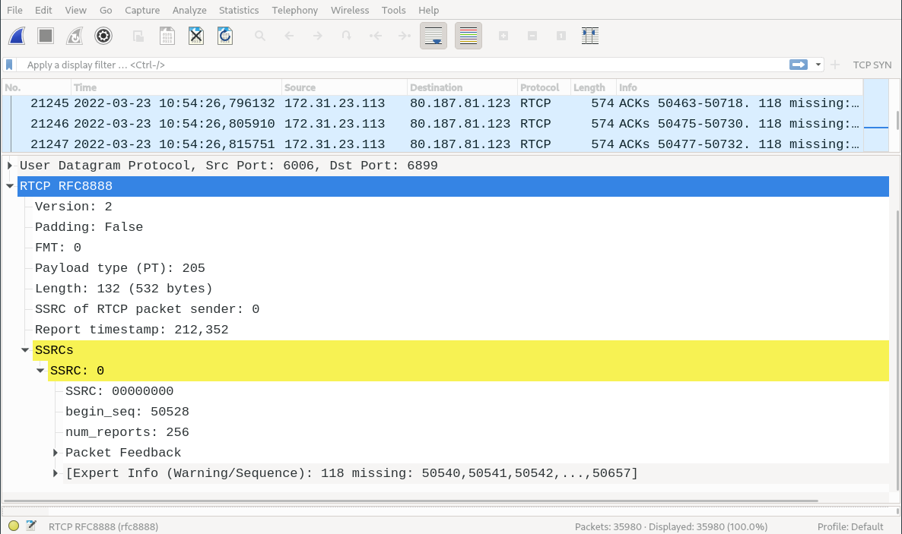

RFC8888 Wireshark Dissector
---

This Lua plugin decodes RTCP packets that follow the format specified in [RFC8888](https://datatracker.ietf.org/doc/html/rfc8888).

Install the plugin by copying it to the [Wireshark plugin folder](https://www.wireshark.org/docs/wsug_html_chunked/ChPluginFolders.html).
